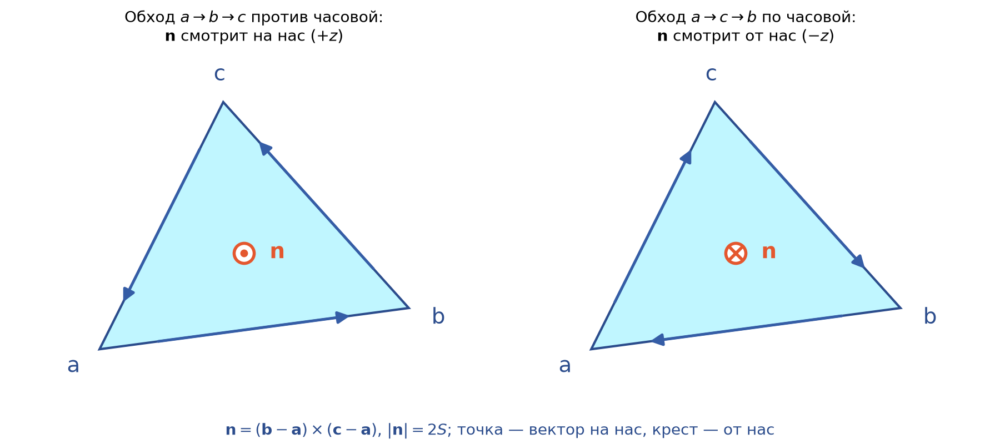
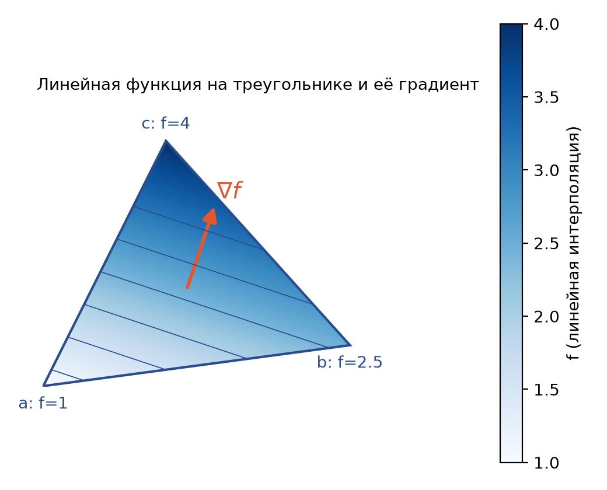

# 1. Линейная алгебра для 3D-геометрии

Весь конвейер morse-lidar начинается с массива точек формы $(n, 3)$ и заканчивается треугольной сеткой со скаляром
в каждой вершине. Между этими этапами работают несколько операций линейной алгебры: скалярное и векторное
произведения (углы, площади, нормали), ортогональные преобразования (смена вертикальной оси, выравнивание по главным
осям) и собственные векторы ковариационной матрицы. В этой главе разобраны именно они, с привязкой к функциям
`mesh.py`, `pointcloud.py`, `surface.py` и `intrinsic.py`.

## 1.1 Векторы и координаты

Точка сканера записывается тройкой $\mathbf{p} = (x, y, z) \in \mathbb{R}^3$. Разность двух точек
$\mathbf{b} - \mathbf{a}$ есть вектор (vector): направленный отрезок от $\mathbf{a}$ к $\mathbf{b}$. Векторы
складываются покоординатно и умножаются на числа; длина (норма) вектора
$|\mathbf{v}| = \sqrt{v_x^2 + v_y^2 + v_z^2}$.

Система координат правая (right-handed), если поворот от оси $x$ к оси $y$ на кратчайший угол, видимый с конца оси $z$,
идёт против часовой стрелки. Все формулы ниже, включая знак векторного произведения, предполагают правую систему.

> **В коде.** Облако хранится в `PointCloud.points` (массив `float` формы `(n, 3)`), вершины сетки в
> `TriMesh.vertices` той же формы. Конструкторы проверяют форму и конечность значений (`np.isfinite`).

## 1.2 Скалярное произведение и угол

Скалярное произведение (dot product)
$$
\mathbf{a}\cdot\mathbf{b} = a_x b_x + a_y b_y + a_z b_z = |\mathbf{a}|\,|\mathbf{b}|\cos\theta,
$$
где $\theta \in [0, \pi]$ — угол между векторами. Отсюда стандартная формула
$\theta = \arccos\frac{\mathbf{a}\cdot\mathbf{b}}{|\mathbf{a}||\mathbf{b}|}$. Ортогональность означает
$\mathbf{a}\cdot\mathbf{b} = 0$, проекция $\mathbf{b}$ на единичный вектор $\mathbf{u}$ равна $\mathbf{u}\cdot\mathbf{b}$.

Формула через $\arccos$ плохо работает для малых (и близких к $\pi$) углов. Производная $\arccos$ в точке $1$
бесконечна: $\cos\theta \approx 1 - \theta^2/2$, и при $\theta \sim 10^{-8}$ величина $\theta^2/2 \sim 10^{-16}$
теряется в округлении double. Проверка:

```python
a, b = np.array([1., 0, 0]), np.array([1., 1e-8, 0])
np.arccos(a @ b / np.linalg.norm(a) / np.linalg.norm(b))   # 0.0
np.arctan2(np.linalg.norm(np.cross(a, b)), a @ b)          # 1e-08
```

Устойчивый вариант использует пару синус–косинус: $|\mathbf{a}\times\mathbf{b}| = |\mathbf{a}||\mathbf{b}|\sin\theta$
(см. 1.3), поэтому
$$
\theta = \operatorname{arctan2}\bigl(|\mathbf{a}\times\mathbf{b}|,\ \mathbf{a}\cdot\mathbf{b}\bigr).
$$
Нормировать векторы не нужно: общий множитель $|\mathbf{a}||\mathbf{b}|$ сокращается, а $\operatorname{arctan2}$
сохраняет полную относительную точность и при малых, и при тупых углах.

> **В коде.** `intrinsic.py`, функция `_corner_geometry()`: для каждого угла треугольника берутся рёбра `first`,
> `second`, считаются `sine = |first × second|` и `cosine = first · second`, затем
> `angles = np.arctan2(sine, cosine)`. Сумма углов при вершине нужна для гауссовой кривизны (гл. 9), а на тонких
> «иглообразных» треугольниках реальных сканов углы бывают очень малы.

## 1.3 Векторное произведение, площадь, нормаль, ориентация

Векторное произведение (cross product)
$$
\mathbf{a}\times\mathbf{b} = (a_y b_z - a_z b_y,\ a_z b_x - a_x b_z,\ a_x b_y - a_y b_x)
$$
перпендикулярно обоим сомножителям, его длина $|\mathbf{a}||\mathbf{b}|\sin\theta$ равна площади параллелограмма,
а направление задаётся правилом правой руки. Оно антикоммутативно: $\mathbf{b}\times\mathbf{a} = -\mathbf{a}\times\mathbf{b}$.

Для треугольника с вершинами $\mathbf{a}, \mathbf{b}, \mathbf{c}$ вектор
$$
\mathbf{n} = (\mathbf{b}-\mathbf{a})\times(\mathbf{c}-\mathbf{a}),\qquad S = \tfrac12|\mathbf{n}|
$$
задаёт нормаль грани (face normal) и удвоенную площадь. Направление $\mathbf{n}$ зависит от порядка обхода вершин:
обход $a\to b\to c$ против часовой стрелки, если смотреть с конца $\mathbf{n}$. Перестановка двух вершин
($a, c, b$) меняет знак нормали. Порядок обхода называют ориентацией треугольника (orientation, winding).

**Пример.** $\mathbf{a} = (0,0,0)$, $\mathbf{b} = (3, 0.4, 0)$, $\mathbf{c} = (1.2, 2.4, 0)$. Тогда
$\mathbf{n} = (0, 0, 3\cdot 2.4 - 0.4\cdot 1.2) = (0, 0, 6.72)$, $S = 3.36$. Нормаль смотрит в $+z$, обход в плоскости
$xy$ идёт против часовой.

{width=80%}

> **В коде.** `mesh.py`, `TriMesh.vertex_areas`: площадь каждой грани `0.5 * |cross(b - a, c - a)|`, вершине
> достаётся треть площади каждой инцидентной грани (барицентрическая площадь, barycentric area). Для того же
> треугольника из примера каждая вершина получает $3.36/3 = 1.12$.
>
> `TriMesh.vertex_normals`: ненормированные нормали граней `cross(b - a, c - a)` суммируются в каждую из трёх вершин
> через `np.add.at`, сумма нормируется. Так как $|\mathbf{n}| = 2S$, это нормаль, взвешенная по площади
> (area-weighted): крупные грани влияют сильнее, вырожденные почти не влияют. Деление на
> `max(length, eps)` защищает от нулевой суммы.

Ориентация граней важна не только для красоты. Знак средней кривизны в `intrinsic.py` определяется скалярным
произведением с `vertex_normals` (гл. 9); если половина граней обходится по часовой стрелке, а половина против,
нормали в вершинах частично гасят друг друга и знак кривизны становится случайным.

> **В коде.** `surface.py`, `reconstruct_delaunay()`: SciPy не гарантирует согласованный обход треугольников
> Делоне, поэтому после триангуляции вычисляются нормали всех граней, и у треугольников с
> `normals[:, scalar_axis] < 0` меняются местами две вершины: `faces[flip][:, [0, 2, 1]]`. После этого все нормали
> смотрят в сторону $+z$ (точнее, $+$`scalar_axis`). Знак $z$-компоненты $\mathbf{n}$ зависит только от $x, y$ вершин,
> то есть совпадает с ориентацией проекции треугольника на плоскость $xy$.

## 1.4 Матрицы, повороты, ортогональные преобразования

Линейное преобразование $\mathbb{R}^3 \to \mathbb{R}^3$ задаётся матрицей $3\times 3$: $\mathbf{p}' = M\mathbf{p}$.
В numpy точки лежат строками, поэтому то же самое записывается как `points @ M.T`. Матрица $Q$ ортогональна,
если $Q^{\mathsf T}Q = I$; её столбцы образуют ортонормированный базис, она сохраняет длины и углы, и
$\det Q = \pm 1$. При $\det Q = +1$ это поворот (rotation), при $\det Q = -1$ — поворот с зеркальным отражением.
Отражение меняет правую систему на левую и, как следствие, переворачивает все нормали из 1.3.

> **В коде.** `pointcloud.py`, `set_up_axis(cloud, up)`. Экспорт iPhone/ARKit использует систему «Y вверх»,
> а пакет считает высотой $Z$. Для `up="y"` столбцы переставляются как `points[:, [2, 0, 1]]`, то есть
> $(x', y', z') = (z, x, y)$. Это циклическая перестановка, её матрица
> $$P = \begin{pmatrix}0&0&1\\1&0&0\\0&1&0\end{pmatrix},\qquad \det P = +1,$$
> то есть настоящий поворот. Простой обмен $y \leftrightarrow z$ имел бы $\det = -1$ и превратил бы купол в
> зеркальный купол с вывернутыми нормалями.

## 1.5 Ковариационная матрица и PCA

Пусть точки облака центрированы: $\mathbf{q}_i = \mathbf{p}_i - \bar{\mathbf{p}}$. Ковариационная матрица
$$
C = \frac{1}{n-1}\sum_{i=1}^{n}\mathbf{q}_i\mathbf{q}_i^{\mathsf T}
$$
симметрична и неотрицательно определена. Для единичного вектора $\mathbf{u}$ величина
$\mathbf{u}^{\mathsf T}C\mathbf{u}$ есть дисперсия проекций точек на направление $\mathbf{u}$. По спектральной теореме
$C = V\Lambda V^{\mathsf T}$, где столбцы $V$ — ортонормированные собственные векторы, $\Lambda = \operatorname{diag}
(\lambda_1 \ge \lambda_2 \ge \lambda_3 \ge 0)$. Максимум дисперсии достигается на $\mathbf{e}_1$, минимум на $\mathbf{e}_3$.
Это метод главных компонент (principal component analysis, PCA). Для почти плоского скана $\mathbf{e}_3$ — нормаль
к «средней плоскости» объекта, то есть естественное направление высоты.

Собственный вектор определён только с точностью до знака: если $C\mathbf{e} = \lambda\mathbf{e}$, то и
$C(-\mathbf{e}) = \lambda(-\mathbf{e})$. Какой знак вернёт `np.linalg.eigh`, не гарантируется, а от знака оси $Z$
зависит, станет объект куполом или чашей, то есть поменяются местами минимумы и максимумы.

> **В коде.** `pointcloud.py`, `align_pca()`:
> ```python
> centred = cloud.points - cloud.points.mean(axis=0)
> _, eigenvectors = np.linalg.eigh(np.cov(centred.T))
> basis = eigenvectors[:, ::-1].copy()  # largest variance first, smallest -> Z
> if basis[2, 2] < 0:  # new Z must not point against the input "up"
>     basis[:, 2] *= -1.0
> if ((centred @ basis[:, 0]) ** 3).mean() < 0:
>     basis[:, 0] *= -1.0
> basis[:, 1] = np.cross(basis[:, 2], basis[:, 0])
> return PointCloud(centred @ basis)
> ```
> `eigh` возвращает собственные значения по возрастанию, поэтому порядок столбцов разворачивается. Знак новой оси $Z$
> выбирается так, чтобы её $z$-компонента была неотрицательной (не смотреть против исходного «верха»; поэтому
> `set_up_axis` вызывается раньше, см. `cli.py`, `_build_mesh()`). Знак $X$ фиксируется третьим моментом
> (асимметрией) проекций. $Y$ не берётся из `eigh`, а вычисляется как $\mathbf{z}\times\mathbf{x}$, что гарантирует
> правую тройку и $\det = +1$.

**Пример.** Облако из 1500 точек с дисперсиями $9, 1, 0.01$ вдоль локальных осей наклонено на $30^\circ$ вокруг $x$.
После `align_pca` дисперсии по $X, Y, Z$ равны $9.01, 1.01, 0.010$; проверка `M.T @ M` даёт единичную матрицу с
погрешностью $2\cdot 10^{-15}$ и $\det M = 1$.

{width=95%}

> **Типичная ошибка.** Ожидать от `align_pca` устойчивости на любых объектах. Если $\lambda_2 \approx \lambda_3$
> (вытянутый цилиндр) или $\lambda_1 \approx \lambda_2$ (круглая чашка), собственные векторы внутри почти равной пары
> определены плохо и прыгают от скана к скану. Если третий момент близок к нулю (симметричный объект), знак $X$
> решает шум. Если $\mathbf{e}_3$ почти горизонтален (скан стены при `up="z"`), $z$-компонента близка к нулю и знак
> новой $Z$ тоже неустойчив. Для сравнения сканов (гл. 8) это означает, что поза должна быть сопоставимой и до PCA.

## 1.6 Линейная функция на треугольнике и её градиент

Значения скаляра заданы только в вершинах. Внутри треугольника функцию продолжают линейно через барицентрические
координаты (barycentric coordinates): точка $\mathbf{p} = \lambda_0\mathbf{p}_0 + \lambda_1\mathbf{p}_1 +
\lambda_2\mathbf{p}_2$, $\lambda_i \ge 0$, $\sum\lambda_i = 1$, получает значение
$$
f(\mathbf{p}) = \lambda_0 f_0 + \lambda_1 f_1 + \lambda_2 f_2 .
$$
Координата $\lambda_i$ равна отношению площади треугольника, противолежащего вершине $i$ (с вершиной $\mathbf{p}$
вместо $\mathbf{p}_i$), к площади $S$. Такая функция линейна на грани, поэтому её градиент постоянен:
$$
\nabla f = \frac{1}{2S}\sum_{i=0}^{2} f_i\,\bigl(\hat{\mathbf{n}}\times\mathbf{e}_i\bigr),
$$
где $\hat{\mathbf{n}}$ — единичная нормаль, $\mathbf{e}_i$ — ребро, противолежащее вершине $i$, взятое по обходу
($\mathbf{e}_0 = \mathbf{p}_2 - \mathbf{p}_1$ и далее циклически). Вектор $\hat{\mathbf{n}}\times\mathbf{e}_i$ лежит в
плоскости грани и перпендикулярен ребру $\mathbf{e}_i$, то есть указывает к вершине $i$.

**Пример.** Треугольник из 1.3, значения $f = (1, 2.5, 4)$. Формула даёт $\nabla f = (0.357, 1.071, 0)$. Проверка:
$\nabla f\cdot(\mathbf{b}-\mathbf{a}) = 1.5 = f_b - f_a$ и $\nabla f\cdot(\mathbf{c}-\mathbf{a}) = 3 = f_c - f_a$.

{width=60%}

Отсюда вывод, важный для гл. 5–6: у кусочно-линейной функции внутри грани и на ребре нет критических точек
(градиент там ненулевой, если значения в вершинах различны), критическими могут быть только вершины.

> **В коде.** Градиент по граням в репозитории явно не вычисляется. Классификатор `critical.py`
> работает только с порядком значений в вершинах, а эвристические сепаратрисы `separatrices.py` идут к соседней
> вершине, ближайшей по рангу среди более низких (при подъёме — среди более высоких), а не по $\nabla f$
> (подробнее в гл. 6). Формула выше нужна, чтобы понимать, насколько грубо такой монотонный путь приближает
> настоящий градиентный поток.

## 1.7 Котангенс угла треугольника

Для угла $\theta$ между рёбрами $\mathbf{u}, \mathbf{v}$, выходящими из одной вершины,
$$
\cot\theta = \frac{\cos\theta}{\sin\theta} = \frac{\mathbf{u}\cdot\mathbf{v}}{|\mathbf{u}\times\mathbf{v}|}.
$$
Котангенсы естественно возникают из градиентов барицентрических координат: для вершин $i \ne j$ с третьей вершиной $k$
$$
S\,\nabla\lambda_i\cdot\nabla\lambda_j = -\tfrac12\cot\theta_k .
$$
В примере из 1.3 угол при $\mathbf{c}$ равен $68.55^\circ$, $\cot = 0.3929$, и обе части равенства дают $-0.1964$.
Суммируя такие слагаемые по граням, получают котангенсный лапласиан (cotangent Laplacian), из которого в гл. 9
вычисляется средняя кривизна.

> **В коде.** `intrinsic.py`, `_corner_geometry()`: `cotangents = cosine / max(sine, eps)` с теми же ненормированными
> `sine` и `cosine`, что и для углов. Защита `eps` спасает от деления на ноль, но у вырожденного треугольника котангенс
> всё равно огромен, поэтому тонкие треугольники Делоне заметно портят кривизну.

## 1.8 Вопросы для самопроверки

1. Почему угол в `_corner_geometry()` вычисляется через `arctan2`, а не через `arccos`? Для каких углов разница существенна?
2. Как изменится `vertex_normals`, если у одной грани поменять местами две вершины?
3. Почему в `vertex_normals` не нормируют нормали граней перед суммированием?
4. Почему `set_up_axis` для `up="y"` использует перестановку `[2, 0, 1]`, а не `[0, 2, 1]`?
5. Какие две неоднозначности знака решает `align_pca` и как? Почему ось $Y$ вычисляется векторным произведением?
6. Где у кусочно-линейной функции на треугольной сетке могут находиться критические точки?

### Ответы

1. Около $\theta = 0$ и $\theta = \pi$ производная $\arccos$ бесконечна, и потеря точности в косинусе даёт большую
   ошибку угла (для $10^{-8}$ рад `arccos` возвращает $0$). Пара $(\sin, \cos)$ в `arctan2` точна во всём диапазоне.
2. Нормаль этой грани сменит знак, и её вклад в нормаль каждой из трёх вершин станет противоположным; соседние нормали
   частично погасятся.
3. Длина ненормированной нормали равна $2S$, поэтому сумма автоматически взвешена по площади граней.
4. `[2, 0, 1]` — циклическая перестановка с $\det = +1$ (поворот). `[0, 2, 1]` — обмен двух осей с $\det = -1$
   (отражение), он меняет ориентацию и знак кривизны.
5. Знак $Z$: $z$-компонента новой оси неотрицательна. Знак $X$: третий момент проекций неотрицателен. $Y = Z\times X$
   делает базис правым, $\det = +1$.
6. Только в вершинах: внутри грани градиент постоянен и при различных значениях в вершинах не равен нулю.

## 1.9 Что почитать

- Botsch M., Kobbelt L., Pauly M., Alliez P., Lévy B. *Polygon Mesh Processing.* A K Peters, 2010 — гл. 1–3 (нормали,
  барицентрические координаты, котангенсная формула).
- Strang G. *Linear Algebra and Its Applications.* — разделы про ортогональные матрицы и спектральное разложение
  симметричной матрицы.
