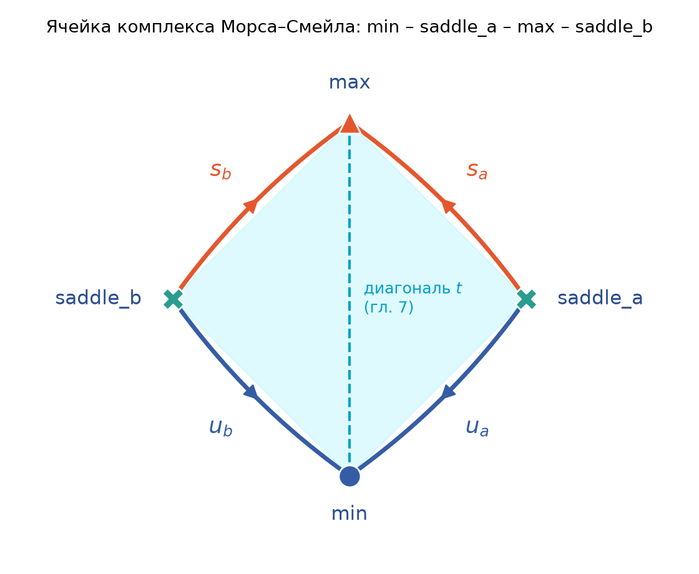

# 6. Комплекс Морса–Смейла и сепаратрисы

Критические точки (главы 4–5) отвечают на вопрос «сколько на поверхности ям, перевалов и вершин». Комплекс
Морса–Смейла отвечает на следующий вопрос: «как они соединены». Это граф на поверхности, вершины которого —
критические точки, а рёбра — особые линии градиента, сепаратрисы. Он разрезает поверхность на простые ячейки и
служит основой дескриптора в `descriptor.py`.

## 6.1 Интегральные линии градиента

Представим каплю воды на рельефе: она течёт вниз по самому крутому направлению, то есть по антиградиенту. Траектория
капли и есть интегральная линия.

**Определение.** Пусть $M$ — замкнутая гладкая поверхность, $f: M \to \mathbb{R}$ — функция Морса (гл. 4).
*Интегральная линия* (integral line) — максимальная кривая $\gamma: \mathbb{R} \to M$, для которой

$$
\frac{d\gamma}{dt}(t) = \nabla f(\gamma(t)), \qquad \nabla f(\gamma(t)) \neq 0 .
$$

Вдоль неё $f$ строго возрастает: $\frac{d}{dt} f(\gamma(t)) = \|\nabla f\|^2 > 0$. На компактной поверхности обе
половины линии сходятся к критическим точкам:

$$
\operatorname{org}(\gamma) = \lim_{t \to -\infty} \gamma(t), \qquad
\operatorname{dest}(\gamma) = \lim_{t \to +\infty} \gamma(t), \qquad
f(\operatorname{org}\gamma) < f(\operatorname{dest}\gamma).
$$

Через каждую регулярную точку проходит ровно одна интегральная линия (теорема существования и единственности для
ОДУ), поэтому линии не пересекаются и покрывают всю поверхность без критических точек.

## 6.2 Устойчивые и неустойчивые многообразия. Сепаратрисы

Соберём все линии, которые «втекают» в критическую точку $p$ и «вытекают» из неё:

$$
D(p) = \{p\} \cup \{x : \operatorname{dest}(\gamma_x) = p\}, \qquad
A(p) = \{p\} \cup \{x : \operatorname{org}(\gamma_x) = p\}.
$$

$D(p)$ — нисходящее (descending) многообразие: всё, куда можно попасть, спускаясь из $p$ по линиям градиента.
$A(p)$ — восходящее (ascending) многообразие: всё, куда можно подняться из $p$. Для потока по $+\nabla f$ это
соответственно устойчивое и неустойчивое многообразия. Это соглашение литературы и TTK: двумерно нисходящее
многообразие максимума и восходящее многообразие минимума.
Размерность определяется индексом $\lambda(p)$ (гл. 4):

| Точка | $\lambda$ | $\dim D(p)$ | $\dim A(p)$ | Смысл |
|---|---|---|---|---|
| минимум | 0 | 0 | 2 | из ямы всё поднимается вверх |
| седло | 1 | 1 | 1 | две линии вниз, две вверх |
| максимум | 2 | 2 | 0 | с вершины всё спускается вниз |

У седла $D(p)$ — две линии, по которым спускаются к минимумам, $A(p)$ — две линии, по которым поднимаются к
максимумам.
Эти четыре линии называются **сепаратрисами (separatrices)**: они разделяют области, стекающие в разные ямы, и
области, поднимающиеся к разным вершинам. В коде у сепаратрисы есть вид `kind`: `u` — дуга от седла вниз к
минимуму (descending), `s` — дуга от седла вверх к максимуму (ascending). Так их определяет
`docs/DATA_CONTRACT.md`: «`kind` is `u` for descent and `s` for ascent». Если смотреть на поток по $-\nabla f$, то
нисходящие дуги образуют неустойчивое (unstable), а восходящие — устойчивое (stable) многообразие седла;
по-видимому, отсюда и буквы.

> **Важно.** Направление «вниз» у дуги `u` — это направление трассировки в коде (от седла к минимуму), а не
> направление градиентного потока. Поле `source` у любой сепаратрисы — седло, `target` — экстремум.

## 6.3 Условие Морса–Смейла

Классический плохой пример — тор, поставленный вертикально, с функцией высоты. На нём минимум внизу, максимум
вверху и два седла: нижняя и верхняя точки отверстия. Восходящие линии нижнего седла идут по внутренней стороне
бублика и упираются точно в верхнее седло. Получается линия «седло → седло», и сепаратрисы двух сёдел совпадают.

**Определение.** Функция Морса $f$ удовлетворяет *условию Морса–Смейла*, если для любых критических $p, q$
многообразия $D(p)$ и $A(q)$ пересекаются трансверсально. На поверхности это равносильно тому, что *нет
интегральных линий из седла в седло*. Действительно, для двух сёдел $D(p)$ и $A(q)$ — кривые, и их трансверсальное
пересечение в двумерной $M$ состоит из изолированных точек. Но пересечение состоит из целых интегральных линий
(оно инвариантно относительно потока), поэтому, если оно непусто, его размерность не меньше 1. Остаётся только
пустое пересечение.

Почему «общая» функция удовлетворяет условию. Связь седло–седло — событие коразмерности 1: стоит немного
наклонить тор, и восходящая линия нижнего седла пройдёт мимо верхнего седла, слева или справа от него. Значит,
сколь угодно малое возмущение $f$ разрушает связь, а малое возмущение функции Морса–Смейла новой связи не
создаёт. Градиенты Морса–Смейла образуют открытое плотное множество (теорема Купки–Смейла), так что на реальных
данных с шумом условие выполняется «почти всегда», хотя на симметричных синтетических полях его легко нарушить.

## 6.4 Ячейки комплекса Морса–Смейла

**Определение.** Комплекс Морса–Смейла (Morse–Smale complex, MSC) — разбиение $M$ на связные компоненты множеств
$D(p) \cap A(q)$. Нульмерные клетки — критические точки, одномерные — сепаратрисы, двумерные — ячейки. Граф из
критических точек и сепаратрис называется 1-скелетом комплекса.

Возьмём точку $x$ внутри ячейки. Её линия начинается в минимуме и кончается в максимуме, а соседние линии идут
туда же, пока не наткнутся на сепаратрису. Поэтому каждая ячейка — «четырёхугольник» с углами
min – saddle – max – saddle и сторонами u, s, s, u (рис. 6.1). Два седла ячейки могут совпадать: седло может
прилегать к одной ячейке двумя секторами.

{width=60%}

**Подсчёт.** Пусть у функции $n_0$ минимумов, $n_1$ простых сёдел и $n_2$ максимумов. У каждого седла 4
сепаратрисы, так что рёбер $E = 4n_1$. Каждая ячейка ограничена 4 сторонами, каждая сторона граничит с 2
ячейками, поэтому $4F = 2E$ и $F = 2n_1$. Проверка через эйлерову характеристику (гл. 3):

$$
V - E + F = (n_0 + n_1 + n_2) - 4n_1 + 2n_1 = n_0 - n_1 + n_2 = \chi(M).
$$

Получилось ровно соотношение Морса из главы 4. Пример: на торе с одним минимумом, двумя сёдлами и одним
максимумом $E = 8$ дуг и $F = 4$ ячейки. На сфере с одним минимумом и одним максимумом сёдел нет, $E = 0$, и
единственная «ячейка» — сфера без двух точек, то есть цилиндр, а не четырёхугольник. Такой случай код TTK-ветки
не принимает (гл. 7).

## 6.5 Дискретный вариант: теория Морса Формана

На триангуляции градиента нет, и интегрировать ОДУ нельзя. Теория Морса Формана (Forman's discrete Morse theory)
заменяет векторное поле комбинаторным объектом.

**Интуиция.** Стрелка «из вершины в ребро» значит «отсюда течёт по этому ребру», стрелка «из ребра в
треугольник» — «через это ребро течёт в треугольник». Каждый симплекс участвует не более чем в одной стрелке.

**Определение (кратко).** *Дискретный градиент* (discrete gradient) — набор пар $(\sigma^{(k)} < \tau^{(k+1)})$
«грань — кофасет», где каждый симплекс входит не более чем в одну пару и нет замкнутых V-путей
$\sigma_0 \to \tau_0 \supset \sigma_1 \to \tau_1 \supset \dots$. Непарные симплексы называются критическими:
вершина — минимум, ребро — седло, треугольник — максимум. Сепаратрисы — V-пути от критического ребра к
критической вершине (вниз) и, в двойственном смысле, к критическому треугольнику (вверх). Пары строятся по
нижним звёздам (lower star) вершин, с порядком симуляции простоты (simulation of simplicity, SoS) того же типа, что и в главе 5.

Ацикличность V-путей гарантирует, что дискретные сепаратрисы конечны, а комбинаторная природа построения — что
результат не зависит от округлений и плато разбираются тем же правилом SoS. Именно так работает TTK (Topology ToolKit,
библиотека на C++): фильтр `ttkMorseSmaleComplex` сначала строит дискретный градиент, затем идёт по V-путям.
Поэтому TTK сообщает критические точки как *клетки*: в `ttk_pipeline.py` у точки есть `CellId` и
`CellDimension` (0, 1 или 2), а сепаратриса хранит `SourceId`/`DestinationId` как номера клеток. Функция
`_separatrices()` ищет концы по ключу `(CellDimension, CellId)`, а вершина сетки `vertex_id` может быть `-1`.

## 6.6 Эвристический бэкенд `separatrices.py`

По умолчанию (`--msc-backend heuristic` в `cli.py`) сепаратрисы считает функция
`trace_separatrices()`. Идея: у седла нижний линк распадается на компоненты (гл. 5), и каждая компонента —
это «сектор», в который уходит одна нисходящая дуга. Из каждой компоненты нижнего линка запускаем монотонный
спуск, из каждой компоненты верхнего — монотонный подъём.

```python
def _trace(mesh, start, direction, neighbors):
    order = mesh.order
    path = [start]
    current = start
    while True:
        candidates = [item for item in neighbors[current]
                      if direction * (order[item] - order[current]) > 0]
        if not candidates:
            return tuple(path)
        current = min(candidates, key=lambda item: direction * order[item])
        path.append(current)
```

Здесь `mesh.order` — ранг вершины в порядке SoS: сначала по значению, при равенстве по индексу
(`TriMesh.order`, гл. 5). `direction = -1` означает спуск, `+1` — подъём. В `trace_separatrices()` стартовая
вершина выбирается тем же ключом: `start = min(component, key=lambda item: direction * order[item])`, после чего
к пути спереди добавляется само седло: `vertices = (point.vertex, *path)`.

**Почему путь конечен и кончается в экстремуме.** Ранги — перестановка чисел $0, \dots, n-1$. На каждом шаге
$\operatorname{order}$ строго убывает (при спуске), значит, вершина не повторяется, цикла нет, и шагов не больше
$n - 1$. Цикл останавливается, когда у текущей вершины нет соседа ниже, то есть нижний линк пуст. По
классификации `analyze_morse()` (`critical.py`) это и есть минимум. Для подъёма всё симметрично: путь кончается
в вершине с пустым верхним линком, то есть в максимуме. Проверка `RuntimeError(... ended at non-extremum ...)` в
коде на замкнутой сетке сработать не может и служит страховкой.

> **Типичная ошибка.** Docstring называет шаг «steepest», но ключ `direction * order[item]` под `min` выбирает при
> спуске соседа с *наибольшим* рангом среди тех, что ниже, а при подъёме — с *наименьшим* среди тех, что выше. Это
> самый пологий монотонный шаг, а не крутейший. Проверка на торе `sin(2πx/16) + 0.4 cos(2πy/12)` (сетка 12×16):
> у максимума $f = 1.400$ соседи ниже имеют значения 1.270, 1.270, 1.324, 1.324, 1.346, 1.346, и `_trace`
> идёт в 1.346, хотя крутейший спуск пошёл бы в 1.270. Монотонность, конечность и правильный конец пути от этого
> не страдают, но дуга получается «лестницей», ближе к линии уровня, чем к линии градиента.

**Сколько дуг.** На каждую компоненту нижнего линка одна дуга `u`, на каждую компоненту верхнего — одна дуга `s`.
У простого седла по 2 компоненты, то есть ровно 2 дуги `u` и 2 дуги `s`. У мульти-седла (multi-saddle) кратности $k$ компонент
по $k+1$, дуг $2(k+1)$. Тест `test_simple_saddles_emit_exactly_two_arcs_each_way` проверяет первое на том же
торе: 2 седла, дуги `["s"]*4 + ["u"]*4`.

```python
>>> d = build_descriptor(periodic_grid_mesh(field_12x16), 0)
>>> d.counts, [(a.kind, a.source, a.target) for a in d.separatrices][:4]
({'min': 1, 'regular': 188, 'saddle': 2, 'max': 1},
 [('u', 12, 108), ('u', 12, 108), ('s', 12, 4), ('s', 12, 4)])
```

Обе дуги `u` седла 12 приходят в один и тот же минимум 108 с разных сторон. Это нормально: на торе с одним
минимумом иначе и быть не может. Пара (источник, цель) поэтому не определяет дугу, к этому вернёмся в гл. 7.

{width=85%}

На рис. 6.2 видны и сильные, и слабые стороны метода. Каждая дуга действительно соединяет седло с экстремумом
нужного типа, а число дуг равно $4 \cdot 6 = 24$. Но дуги идут ступенями, а 19 пар дуг одного вида имеют общие
внутренние вершины: дуги сливаются, не дойдя до экстремума (у линий настоящего градиента так не бывает,
они могут сойтись только в критической точке).

**Открытые поверхности.** На сетке с краем (`grid_mesh`) граничные вершины исключены из классификации, и спуск
может закончиться на крае, где нет критической точки. Тогда дуга не отбрасывается, а помечается
`ends_on_boundary=True`, а в JSON её `destination_id` равен `null` (`cli.py`, `_descriptor_json()`). Путь при этом
может пройти часть пути по краю. Подробно — в главе 10.

## 6.7 Чем эвристика отличается от настоящего комплекса

Docstring `trace_separatrices()` прямо говорит: «This is intentionally not presented as a substitute for TTK's
MSC». Причины:

1. **Дуги могут сливаться и касаться.** В гладком случае линии градиента не сливаются вне критических точек.
   Монотонные пути по вершинам свободно проходят через одни и те же вершины, и никакой структуры, которая
   учитывала бы такие слияния, эвристика не строит.
2. **Нет ячеек.** Эвристика выдаёт только список дуг. Поля `quadrilaterals` и `colored_graph` у дескриптора из
   `build_descriptor()` пусты (`()` и `None`).
3. **Нет гарантии Морса–Смейла.** Ничто не проверяет, что дуги разных сёдел не совпадают и что четыре дуги седла
   действительно разделяют поверхность на четырёхугольники.
4. **Геометрия зависит от разбиения сетки.** Шаг выбирается по рангу, без учёта длины ребра, так что при
   анизотропной сетке форма дуг меняется.

Эвристика полезна как дешёвый, детерминированный эталон для тестов и для проверки контракта JSON. Комбинаторную
структуру поверхности она не даёт.

## 6.8 TTK-бэкенд

`ttk_backend.run_ttk_msc(mesh)` делает следующее.

1. Находит интерпретатор ParaView `pvpython` (`_find_pvpython()`: аргумент, переменная `MORSE_LIDAR_PVPYTHON`,
   `PATH`, затем локальная копия в `.tools/`). Если его нет, бросает `RuntimeError` с сообщением из `status()`.
2. Пишет сетку и значения в файл legacy VTK (`export_legacy_vtk()`, массив `ScalarField`).
3. Запускает `ttk_pipeline.py` в отдельном процессе. Тот применяет `ttkMorseSmaleComplex` (критические точки,
   восходящие и нисходящие 1-сепаратрисы; дуги седло–седло отключены: `SetComputeSaddleConnectors(False)`) и
   `ttkMorseSmaleQuadrangulation`, затем сериализует всё в JSON. Тип сепаратрисы `SeparatrixType = 0` становится
   `kind = "u"`, остальные — `"s"`.
4. Восстанавливает ячейки и раскрашенный граф (`_colored_dual()`, гл. 7).

CLI требует замкнутую сетку: при `--msc-backend ttk` на открытой сетке он завершается с сообщением
«requires a closed mesh for the mandatory trivalent graph». Причина в том, что у каждой дуги должно быть ровно
две соседние ячейки, а у дуги на крае только одна.

Каждая ячейка возвращается как `MorseSmaleQuadrilateral` (`descriptor.py`):

```python
morse_smale_cells.append(
    MorseSmaleQuadrilateral(center, ids, (u_a, s_a, s_b, u_b))
)
```

где `ids = (min, saddle_a, max, saddle_b)` — идентификаторы критических точек, а `separatrices = (u_a, s_a, s_b,
u_b)` — обход границы по кругу: $u_a$ (min–saddle_a), $s_a$ (saddle_a–max), $s_b$ (max–saddle_b), $u_b$
(saddle_b–min), как на рис. 6.1. Какое седло назвать `saddle_a`, решает сортировка путей по ключу (идентификатор
дуги `u`, идентификатор седла). Поле `identifier` ячейки — номер вершины-центра в квадрангуляции TTK, а не
порядковый номер.

## 6.9 Упрощение по персистентности: TTK и наш код

Шум даёт множество мелких пар «минимум–седло» и «седло–максимум» (гл. 8). В настоящем комплексе их убирают
*сокращением* (cancellation): пара удаляется, а сепаратрисы соседей перестраиваются в обход. В экосистеме TTK
для этого перед построением комплекса применяют, например, фильтр `TopologicalSimplification` — его и рекомендует
README. В `ttk_pipeline.py` упрощение не вызывается: комплекс строится по исходному полю.

В нашем коде есть только `persistence.persistent_counts()`: она считает, сколько критических точек участвует
в парах с персистентностью не меньше порога. Docstring честно предупреждает: «does not reroute separatrices, i.e.
it is not a full Morse-Smale cancellation». То же в `DATA_CONTRACT.md`: «`persistent_counts` filters pairs only;
arcs and graph are not simplified». Значит, после `--persistence-threshold` числа в `persistent_counts`
уменьшаются, а списки `separatrices`, `quadrilaterals` и `colored_graph` в отчёте остаются прежними.

> **В коде.** Нельзя сравнивать `persistent_counts["saddle"]` с `len(separatrices) / 4`: первое отфильтровано,
> второе нет.

## 6.10 Вопросы для самопроверки

1. Почему интегральная линия не может начинаться и кончаться в одной и той же критической точке?
2. Сколько сепаратрис у мульти-седла кратности 2 в `trace_separatrices()` и почему?
3. Сколько ячеек у комплекса Морса–Смейла функции на сфере с 2 минимумами, 3 сёдлами и 3 максимумами?
4. Почему `_trace()` делает не больше $n-1$ шагов. Что изменится, если заменить `min` на `max` в выборе
   соседа?
5. Почему TTK-бэкенд отказывается работать с открытой сеткой?
6. После запуска с `--persistence-threshold 0.5` число сёдел в `persistent_counts` упало с 10 до 2. Сколько дуг
   будет в поле `separatrices`?

### Ответы

1. Вдоль линии $f$ строго растёт, поэтому $f(\operatorname{org}) < f(\operatorname{dest})$.
2. У мульти-седла кратности 2 по 3 компоненты нижнего и верхнего линка, значит, 3 дуги `u` и 3 дуги `s`, всего 6.
3. Проверка: $2 - 3 + 3 = 2 = \chi(S^2)$. Ячеек $F = 2n_1 = 6$, дуг $4n_1 = 12$.
4. Ранг строго монотонен и принимает $n$ значений. С `max` путь станет крутейшим спуском в смысле ранга
   (самый низкий сосед); конечность и конец в экстремуме сохранятся, изменится форма дуг.
5. Дуга на краю граничит с одной ячейкой, и дуальное ребро построить нельзя; `_colored_dual()` и
   `validate_colored_graph()` требуют ровно двух треугольников на дугу.
6. Столько же, сколько без порога (для 10 простых сёдел — 40): `persistent_counts` дуги не перестраивает.

## 6.11 Что почитать

- H. Edelsbrunner, J. Harer, A. Zomorodian. Hierarchical Morse–Smale complexes for piecewise linear 2-manifolds.
  *Discrete & Computational Geometry*, 30 (2003), 87–107.
- R. Forman. A user's guide to discrete Morse theory. *Séminaire Lotharingien de Combinatoire*, 48 (2002).
- J. Tierny, G. Favelier, J. A. Levine, C. Gueunet, M. Michaux. The Topology ToolKit. *IEEE Transactions on
  Visualization and Computer Graphics*, 24(1) (2018).
