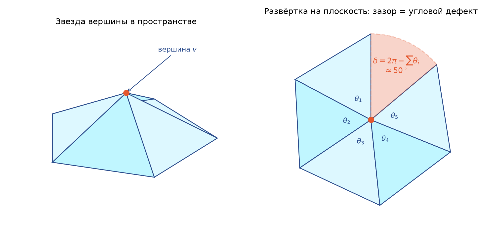

# 9. Геометрия поверхности, кривизна и скалярные поля

В главах 4–8 поверхность была «резиновой»: значение имели только вершины, рёбра, грани и порядок значений функции в вершинах. Но дескриптор Морса строится не для поверхности, а для пары «поверхность + скалярное поле», и само поле обычно берётся из геометрии: высота точки, кривизна в точке. Эта глава объясняет, какие геометрические величины считает `intrinsic.py`, что именно они измеряют и как ведут себя при повороте скана и шуме.

## 9.1 Метрика и топология

Интуиция. Возьмём лист бумаги. Его можно свернуть в цилиндр, не растягивая и не сминая. Длины кривых на листе при этом не меняются, а форма в пространстве меняется. Теперь возьмём резиновый лист и растянем его. Длины меняются, но лист остаётся диском: в нём не появилось дыр, и он не склеился сам с собой.

Строго. *Метрика* (metric) поверхности задаёт длины кривых и углы между ними, измеренные внутри поверхности. Отображение, сохраняющее длины всех кривых, называется *изометрией* (isometry); изгибание бумаги — изометрия. *Топология* (topology) сохраняется при любом гомеоморфизме, то есть взаимно однозначном и непрерывном в обе стороны отображении, включая растяжения. Получается три уровня:

| Преобразование | Длины, углы | Гауссова кривизна $K$ | Средняя кривизна $H$ | Эйлерова характеристика $\chi$ |
|---|---|---|---|---|
| Поворот и сдвиг (движение) | сохраняются | сохраняется | сохраняется | сохраняется |
| Изгибание без растяжения (изометрия) | сохраняются | сохраняется | меняется | сохраняется |
| Растяжение (гомеоморфизм) | меняются | меняется | меняется | сохраняется |

Для проекта это значит следующее. Число критических точек любой функции Морса на поверхности ограничено её топологией: $\#\min - \#\text{saddle} + \#\max = \chi$ (гл. 3–4). А сколько именно будет минимумов и сёдел и где они окажутся, зависит от выбранного поля. Это поле и несёт информацию о форме.

## 9.2 Скалярное поле: от его выбора зависит весь дескриптор

*Скалярное поле* (scalar field) на поверхности — функция $f: M \to \mathbb{R}$; в коде это массив `TriMesh.values`, одно число на вершину. Критические точки, сепаратрисы и пары персистентности считаются по `values`, а координаты `vertices` используются только для геометрии. Поэтому один и тот же скан с разными полями даёт совершенно разные дескрипторы. В CLI поле выбирается флагом `--scalar` из четырёх вариантов: `height`, `gaussian-curvature`, `mean-curvature`, `shape-index` (`intrinsic.py`, функция `intrinsic_scalar()`).

### Поле высоты зависит от позы скана

Высота $f(\mathbf{p}) = z$ — это проекция на ось $Z$, то есть на направление, выбранное сканером, а не объектом. Если повернуть скан, функция $f$ станет другой, и критические точки сдвинутся, появятся или исчезнут. Числовой пример (рис. 9.1): рельеф из двух бугров и одной ямы на сетке $61 \times 61$ с шагом 0,1. В исходной позе внутри 1 минимум, 1 седло и 2 максимума. Повернём ту же сетку на 20° вокруг оси $y$ и возьмём новую координату $z$ как поле. Получится 1 минимум, 3 седла и 2 максимума. После поворота на 45° внутри не остаётся ни одной критической точки: наклон «перевешивает» бугры, и все экстремумы уходят на край.

{width=90%}

> **В коде.** Против зависимости от позы в `pointcloud.py` есть три средства, и `cli.py` (`_build_mesh()`) применяет их в таком порядке:
> 1. `set_up_axis(cloud, up)` переставляет оси так, чтобы указанная ось стала $+Z$. Это нужно для экспорта ARKit/iPhone, где «вверх» — это $Y$.
> 2. `remove_dominant_plane(cloud, distance)` методом RANSAC (500 итераций, `seed=0`) ищет плоскость с наибольшим числом точек в пределах `distance` и удаляет эти точки, например пол или стол.
> 3. `align_pca(cloud)` центрирует облако и поворачивает главные оси ковариации на $X, Y, Z$. Направление наименьшей дисперсии становится $Z$, его знак согласуется со старым $+Z$, а знак $X$ выбирается по третьему моменту, чтобы результат был детерминирован.
>
> После этого облако прореживается (`voxel_downsample`) и превращается в сетку.

> **Типичная ошибка.** `align_pca` даёт устойчивую позу только тогда, когда собственные значения ковариации хорошо различаются (плоский или вытянутый объект). Для почти изотропного объекта оси PCA неустойчивы: небольшой шум поворачивает их, а вместе с ними меняется и поле высоты. Код такой случай не обнаруживает. Кроме того, если самый большой плоский участок — это сам объект (например, стена), `remove_dominant_plane` удалит именно его.

Второй путь — взять поле, которое от позы не зависит вообще. Это кривизна. Чтобы понять её, нужно несколько определений.

## 9.3 Нормаль, главные кривизны, $H$ и $K$

Интуиция. Около гладкой точки поверхность почти совпадает со своей *касательной плоскостью* (tangent plane). Кривизна показывает, насколько быстро поверхность от этой плоскости отходит и в какую сторону.

Строго. Пусть $\mathbf{n}$ — единичная *нормаль* (normal) в точке $\mathbf{p}$, перпендикулярная касательной плоскости. Плоскость, которая содержит $\mathbf{n}$ и касательное направление $\mathbf{t}$, высекает из поверхности кривую — *нормальное сечение* (normal section). Её кривизна со знаком обозначается $k(\mathbf{t})$. В проекте принято соглашение `intrinsic.py`: $k > 0$, когда сечение загибается *от* нормали (центр кривизны лежит со стороны $-\mathbf{n}$), как у купола с нормалью наружу. Максимум и минимум $k(\mathbf{t})$ по направлениям называются *главными кривизнами* (principal curvatures) $k_1 \ge k_2$; соответствующие направления ортогональны. Из главных кривизн составляют две величины:

$$
H = \frac{k_1 + k_2}{2}, \qquad K = k_1 k_2 .
$$

$H$ — *средняя кривизна* (mean curvature), измеряется в $1/\text{длина}$. $K$ — *гауссова кривизна* (Gaussian curvature), измеряется в $1/\text{длина}^2$. Знак $K$ не зависит от выбора нормали: $K > 0$ означает, что поверхность изогнута в одну сторону по всем направлениям (купол или чаша), $K < 0$ — что в разные стороны (седло). Знак $H$ при смене нормали $\mathbf{n} \to -\mathbf{n}$ меняется на противоположный.

| Поверхность | $k_1$ | $k_2$ | $H$ | $K$ |
|---|---|---|---|---|
| Сфера радиуса $R$ (нормаль наружу) | $1/R$ | $1/R$ | $1/R$ | $1/R^2$ |
| Цилиндр радиуса $R$ | $1/R$ | $0$ | $1/(2R)$ | $0$ |
| Седло $z = a(x^2 - y^2)$ в начале координат | $2a$ | $-2a$ | $0$ | $-4a^2$ |
| Плоскость | $0$ | $0$ | $0$ | $0$ |

Пример с числами: на сфере радиуса $R = 10$ см получаем $H = 0{,}1\ \text{см}^{-1}$ и $K = 0{,}01\ \text{см}^{-2}$. Если перейти к метрам, получится $H = 10\ \text{м}^{-1}$ и $K = 100\ \text{м}^{-2}$. Поэтому `DATA_CONTRACT.md` требует одинаковых единиц у сравниваемых сканов: код единицы не пересчитывает.

## 9.4 Theorema Egregium и теорема Гаусса–Бонне

*Theorema Egregium* («замечательная теорема») Гаусса: $K$ выражается только через метрику, то есть через длины и углы, измеренные внутри поверхности. Поэтому изгибание без растяжения $K$ не меняет. Лист бумаги ($K = 0$) можно свернуть в цилиндр ($K = 0$, хотя $H = 1/(2R) \neq 0$), но нельзя без складок обернуть вокруг сферы ($K > 0$). $H$ внутренней величиной не является: она зависит от того, как поверхность расположена в пространстве.

*Теорема Гаусса–Бонне* (Gauss–Bonnet) связывает геометрию с топологией. Для компактной поверхности $M$ с краем $\partial M$

$$
\int_M K\, dA + \int_{\partial M} k_g\, ds = 2\pi \chi(M),
$$

где $k_g$ — *геодезическая кривизна* (geodesic curvature) края, то есть его кривизна внутри поверхности. Для замкнутой поверхности второго слагаемого нет. Например, для сферы $\frac{1}{R^2} \cdot 4\pi R^2 = 4\pi = 2\pi \cdot 2$. Смысл теоремы: кривизну можно перераспределять по поверхности, но её полный запас фиксирован топологией. Из этого видно, что поле кривизны не может быть «произвольным»: у тора $\int K\,dA = 0$, поэтому на любом торе есть области и с $K > 0$, и с $K < 0$.

## 9.5 Дискретная гауссова кривизна: угловой дефект

Интуиция. Сложим углы всех треугольников, сходящихся в вершине $v$. Если звезда вершины плоская, сумма равна $2\pi$. Если вершина — «кончик» конуса, сумма меньше $2\pi$: развернув звезду на плоскость, получим зазор (рис. 9.2). Если звезда «гофрированная», как седло, сумма больше $2\pi$.

{width=80%}

Строго. *Угловой дефект* (angle defect) вершины с углами треугольников $\theta_j$ при ней:

$$
\delta(v) = 2\pi - \sum_j \theta_j \quad \text{(внутренняя вершина)}, \qquad \delta(v) = \pi - \sum_j \theta_j \quad \text{(граничная вершина)} .
$$

Дефект — это «полная кривизна» маленького куска поверхности около вершины. Чтобы получить кривизну в точке, его делят на площадь, приписанную вершине. В проекте это *барицентрическая площадь* (barycentric area): каждой вершине достаётся треть площади каждого прилегающего треугольника, так что $\sum_v A_v$ равна площади всей сетки.

$$
K(v) = \frac{\delta(v)}{A_v}, \qquad A_v = \sum_{t \ni v} \frac{\operatorname{area}(t)}{3}.
$$

Дискретная теорема Гаусса–Бонне выполняется *точно*: $\sum_v \delta(v) = 2\pi\chi$. Граничный дефект $\pi - \sum\theta_j$ играет роль дискретной $k_g\,ds$. Проверка на открытом рельефе $41 \times 41$ из гл. 10: внутренние дефекты в сумме дают $-0{,}0013$, граничные $6{,}2845$, итого $\sum\delta / 2\pi = 1{,}0000000$, что совпадает с $\chi$ диска.

> **В коде.** `mesh.py`, `TriMesh.vertex_areas` — барицентрическая площадь. `intrinsic.py`, `_corner_geometry()` считает угол при каждом углу треугольника через `arctan2(|a×b|, a·b)` (это точнее, чем `arccos`) и котангенс $\cos/\sin$. `_raw_gaussian_curvature()` суммирует углы по вершинам через `np.add.at`, вычитает их из цели $2\pi$ (для граничных вершин $\pi$) и делит на площадь. Наружу, через `gaussian_curvature()`, отдаётся уже результат `_extend_to_boundary()`: значения на краю заменяются продолжением изнутри (гл. 10), поэтому цель $\pi$ в итоговом поле не участвует.

## 9.6 Дискретная средняя кривизна: котангенсный оператор Лапласа–Бельтрами

Интуиция. Если каждую точку поверхности сместить к среднему её соседей, купол «просядет» внутрь. Вектор этого сдвига направлен по нормали, и его длина пропорциональна $H$.

Строго. Оператор Лапласа–Бельтрами (Laplace–Beltrami operator), применённый к координатной функции $\mathbf{x}$ поверхности, даёт $\Delta \mathbf{x} = -2H\mathbf{n}$. Дискретная версия — *котангенсная формула* (cotangent formula):

$$
\Delta \mathbf{x}_i \approx \frac{1}{2A_i} \sum_{j \sim i} (\cot\alpha_{ij} + \cot\beta_{ij})\,(\mathbf{x}_j - \mathbf{x}_i),
$$

где $\alpha_{ij}, \beta_{ij}$ — углы, противолежащие ребру $ij$ в двух прилегающих треугольниках. Отсюда $H_i = -\langle \Delta\mathbf{x}_i, \mathbf{n}_i\rangle / 2$.

```python
def _raw_mean_curvature(mesh, corners, cotangents):
    laplacian = np.zeros_like(mesh.vertices)
    for corner in range(3):
        following, previous = (corner + 1) % 3, (corner + 2) % 3
        # Edge (corner, following) is opposite ``previous`` and vice versa.
        contribution = cotangents[:, previous, None] * (corners[:, following] - corners[:, corner]) \
            + cotangents[:, following, None] * (corners[:, previous] - corners[:, corner])
        np.add.at(laplacian, mesh.faces[:, corner], contribution)
    # Laplace-Beltrami of the embedding: laplacian / (2A) = -2 H n.
    return -np.einsum("ij,ij->i", laplacian, mesh.vertex_normals) / (4.0 * _safe_area(mesh))
```

Разбор. Каждый треугольник добавляет своей вершине `corner` два слагаемых: ребро к `following` с котангенсом противолежащего угла `previous` и ребро к `previous` с котангенсом угла `following`. После суммирования по всем треугольникам каждое ребро $ij$ получает ровно $\cot\alpha + \cot\beta$, и `laplacian` равен сумме в формуле *без* множителя $1/(2A)$. Значит, $\langle\texttt{laplacian}, \mathbf{n}\rangle = 2A\cdot(-2H)$, и $H = -\langle\cdot\rangle/(4A)$, что и написано в последней строке. Нормаль `vertex_normals` — сумма ненормированных векторных произведений граней (то есть взвешенная по площади), затем нормированная.

> **Важно.** Знак $H$ задаётся ориентацией граней. При обходе вершин против часовой стрелки нормаль грани $(\mathbf{b}-\mathbf{a})\times(\mathbf{c}-\mathbf{a})$ направлена «наружу купола», и тогда $H > 0$. Проверка: на икосфере с наружной ориентацией среднее $H = +0{,}5$ при $R = 2$; если перевернуть все грани (`faces[:, [0, 2, 1]]`), получится $-0{,}5$, а $K$ не меняется. Для полей высоты нормали направлены к $+Z$: `grid_mesh` строит грани $(a, b, d)$ и $(a, d, c)$ с нормалью вверх, а `reconstruct_delaunay` явно переворачивает треугольники с $n_z < 0$, потому что SciPy ориентацию не гарантирует. Для Poisson-сетки ориентация берётся из Open3D, и код её не проверяет.

## 9.7 Shape index Кендеринка

$H$ и $K$ зависят от масштаба. *Shape index* (индекс формы) Кендеринка от масштаба не зависит и описывает только «тип» формы:

$$
S = \frac{2}{\pi}\arctan\frac{k_1 + k_2}{k_1 - k_2} \in [-1, 1].
$$

$S = +1$ — купол (cap, $k_1 = k_2 > 0$), $S = 0{,}5$ — цилиндр-«хребет», $S = 0$ — симметричное седло, $S = -0{,}5$ — желоб, $S = -1$ — чаша (cup). При растяжении поверхности в $\lambda$ раз $H$ делится на $\lambda$, $K$ — на $\lambda^2$, а $S$ не меняется.

Главные кривизны выражаются через $H$ и $K$: $k_{1,2} = H \pm \sqrt{H^2 - K}$. Значит, $k_1 + k_2 = 2H$ и $k_1 - k_2 = 2\sqrt{H^2 - K}$, откуда

$$
S = \frac{2}{\pi}\operatorname{arctan2}\!\left(H,\ \sqrt{\max(H^2 - K, 0)}\right).
$$

Именно так это написано в `intrinsic.py`, функция `shape_index()`. Обе детали в этой формуле важны. `arctan2` корректно обрабатывает омбилическую точку $k_1 = k_2$, где знаменатель равен нулю: при $H > 0$ получается $S = 1$. `max(·, 0)` нужен потому, что дискретные $H$ и $K$ считаются разными формулами и согласованы не точно, так что $H^2 - K$ может оказаться немного отрицательным. Рис. 9.3 показывает $H$ и $S$ на синтетическом рельефе: вершины бугров — купола (красное), дно ямы — чаша (синее), между ними сёдла и желоба.

{width=100%}

> **Типичная ошибка.** На почти плоском участке $H$ и $K$ малы, и $S$ определяется ошибками округления. При повороте рельефа из рис. 9.1 на 20° поля $K$ и $H$ совпали до $4\cdot 10^{-13}$, а $S$ в 92 почти плоских вершинах (там $|H| < 1{,}3\cdot 10^{-6}$) изменился до $0{,}98$. Строка документации «плоские вершины получают 0» верна только для *точного* нуля, когда `arctan2(0, 0) = 0`.

## 9.8 Инвариантность к повороту и чувствительность к шуму

$K$, $H$ и $S$ строятся из длин, углов и площадей треугольников, а эти величины поворот не меняет. Поэтому для повторных сканов одного объекта, снятых с разных сторон, поле кривизны даёт одинаковые критические точки, если совпадает триангуляция. В опыте из п. 9.7 поле $H$ после поворота дало те же 24 минимума, 31 седло и 10 максимумов. Оговорка: и растр, и `reconstruct_delaunay` триангулируют проекцию на плоскость $XY$, поэтому при повороте *облака* меняется и сама сетка. Тогда поля кривизны совпадают лишь приближённо, и тем точнее, чем мельче сетка и меньше шум (п. 9.9 показывает, что поточечная оценка зависит от формы треугольников).

Цена инвариантности — вторые производные. Шум глубины амплитуды $\varepsilon$ при шаге сетки $h$ даёт ошибку кривизны порядка $\varepsilon/h^2$. Опыт на сферической шапке $R = 10$ с белым шумом $\varepsilon = 10^{-3}$ (средняя квадратичная ошибка по внутренним вершинам):

| Шаг $h$ | Ошибка $H$, без сглаживания | Ошибка $H$, `sigma=1` | Ошибка $K$, без сглаживания | Ошибка $K$, `sigma=1` |
|---|---|---|---|---|
| 0,05 | 0,837 | 0,144 | 0,820 | 0,046 |
| 0,1 | 0,213 | 0,093 | 0,068 | 0,022 |
| 0,2 | 0,051 | 0,066 | 0,011 | 0,013 |
| 0,4 | 0,014 | 0,047 | 0,003 | 0,008 |

Без сглаживания ошибка $H$ уменьшается в 4 раза при каждом удвоении шага, как и предсказывает оценка $\varepsilon/h^2$. При крупном шаге гауссово сглаживание уже вредит: оно размывает саму сферу, и смещение (bias) становится больше шума. На рельефе $61 \times 61$ с шумом $0{,}01$ поле $H$ без сглаживания даёт 571 минимум, 1005 сёдел и 600 максимумов, при `sigma=3` — 33, 40 и 25. У высоты в тех же условиях было 306, 587 и 309 точек: шум бьёт по кривизне сильнее.

> **В коде.** Есть два средства. `preprocess.py`, `denoise_depth()` применяет медианный фильтр (`--median-size`, нечётный) и затем гауссов (`--sigma`, в пикселях растра); режим края `nearest` для открытой поверхности и `wrap` для периодической. Работает он только для `--geometry raster`: для Delaunay/Poisson `cli._validate()` отклоняет ненулевые `--sigma` и `--median-size`, потому что сглаживания сетки в коде нет. `pointcloud.py`, `voxel_downsample()` оставляет в каждом вокселе *первую по индексу* точку (`np.unique(..., return_index=True)`), а не среднее. Шум отдельной точки это не уменьшает, но увеличивает шаг $h$, а значит, уменьшает $\varepsilon/h^2$. Ни один из этих способов не заменяет фильтрацию по персистентности (гл. 8).

## 9.9 Проверка на сфере

Сравним дискретные $K$ и $H$ с точными $1/R^2 = 0{,}25$ и $1/R = 0{,}5$ при $R = 2$. Икосфера строится делением граней икосаэдра на четыре части с проекцией новых вершин на сферу; UV-сфера — сетка по широте и долготе с двумя полюсами. Сетку обернули в `TriMesh(V, F, V[:, 2])`.

| Сетка | Вершин | $K$: медиана | $K$: худшая вершина | $H$: медиана | $H$: худшая вершина | $\sum K A_v / 2\pi$ |
|---|---|---|---|---|---|---|
| Икосфера, 1 деление | 42 | 0,2613 | 0,2949 (валентность 5) | 0,4839 | 0,5512 | 2,000000 |
| Икосфера, 2 деления | 162 | 0,2522 | 0,2885 | 0,4950 | 0,5673 | 2,000000 |
| Икосфера, 4 деления | 2562 | 0,2501 | 0,2866 | 0,4997 | 0,5726 | 2,000000 |
| UV-сфера $64\times128$ | 8066 | 0,2502 | 0,1877 (полюс) | 0,5001 | 0,3752 | 2,000000 |
| Шапка $z=\sqrt{100-x^2-y^2}$, `grid_mesh`, $h=0{,}1$ | 3721 | центр 0,0100000 (точно 0,01) | — | центр 0,099997 (точно 0,1) | — | — |

Выводы. Интеграл кривизны точен всегда, это дискретная теорема Гаусса–Бонне ($\chi = 2$). Типичная вершина сходится к точному значению. Но в 12 вершинах валентности 5 икосферы ошибка около $+15\%$, а на полюсе UV-сферы около $-25\%$, и при измельчении сетки эти ошибки *не уменьшаются*. Причина в барицентрической площади: она точна для регулярных сеток вроде `grid_mesh` (тест `tests/test_curvature_accuracy.py`), но не равна «правильной» площади Вороного у нерегулярных вершин. По той же причине в вершинах валентности 5 shape index равен 0,78 вместо 1: ошибки $H$ и $K$ не согласованы, и сфера «выглядит» местами не как купол. Для Delaunay-сеток реальных сканов это значит, что поточечная кривизна содержит шум триангуляции.

## 9.10 Вопросы для самопроверки

1. Какие из величин $K$, $H$, $S$, $\chi$ сохраняются при сворачивании листа в цилиндр, а какие при растяжении резинового листа?
2. Почему при повороте скана меняются критические точки поля высоты, но не поля $K$? Почему для растра и Delaunay это верно лишь приближённо?
3. Чему равна сумма угловых дефектов по всем вершинам открытой сетки-диска и почему это не зависит от формы рельефа?
4. Что произойдёт со знаком `mean_curvature` и `shape_index`, если перевернуть ориентацию всех граней? А с `gaussian_curvature`?
5. Зачем в `shape_index()` стоят `arctan2` и `np.maximum(..., 0)`?
6. Почему уменьшение шага сетки вдвое без сглаживания примерно учетверяет шум кривизны?

### Ответы

1. При изгибании сохраняются $K$ и $\chi$, а $H$ и $S$ меняются: у плоскости $H = 0$ (код даёт $S = 0$), у цилиндра $H = 1/(2R)$ и $S = 0{,}5$. При растяжении сохраняется только $\chi$.
2. Высота — это проекция на внешнюю ось, а $K$ строится из длин и углов, которые поворот не меняет. Растр и Delaunay строятся в проекции на $XY$, поэтому поворот облака меняет саму сетку, а с ней и дискретную оценку кривизны.
3. $2\pi\chi = 2\pi$ (если граничные вершины считать с целью $\pi$). Это дискретная теорема Гаусса–Бонне: сумма углов по всем треугольникам равна $\pi F$, а остальное — комбинаторика $V - E + F$.
4. $H$ и $S$ сменят знак (купол станет чашей), $K$ не изменится.
5. `arctan2` корректно обрабатывает омбилическую точку $k_1 = k_2$, где знаменатель равен нулю. `maximum` нужен, потому что дискретные $H$ и $K$ не согласованы точно и $H^2 - K$ может оказаться немного отрицательным.
6. Кривизна — это вторая производная; разностная оценка второй производной от шума амплитуды $\varepsilon$ имеет порядок $\varepsilon/h^2$.

## 9.11 Что почитать

- M. P. do Carmo. *Differential Geometry of Curves and Surfaces.* Prentice-Hall, 1976 — главные кривизны, Theorema Egregium, Гаусс–Бонне.
- M. Meyer, M. Desbrun, P. Schröder, A. H. Barr. *Discrete Differential-Geometry Operators for Triangulated 2-Manifolds.* In: Visualization and Mathematics III, Springer, 2003 — котангенсная формула, угловой дефект, площади Вороного и барицентрические.
- J. J. Koenderink, A. J. van Doorn. *Surface shape and curvature scales.* Image and Vision Computing 10(8), 1992 — shape index и curvedness.
